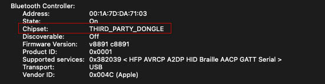

# How to use Hideez Bluetooth Dongle on macOS

#### This video describes dongle installation process for macOS by the example of Big Sur:



#### This video shows how to install the dongle on macOS Monterey:




**Note!** The connection may be unstable on macOS Monterey. If you haven’t managed to connect your Bluetooth dongle even though you’ve followed all of the following steps, please [contact us](https://hideez.com/pages/contact-hideez-support) to get support. Our agent will reply to you with an email within 24 hours.


Before setting up, we are warning you about one thing:


**YOU WILL LOSE BLUETOOTH CONNECTIVITY IN THE INITIAL SETUP PROCESS, AND ALL DEVICES WILL NEED TO BE RE-PAIRED.**


The re-pairing process only needs to be done once, and they will be remembered.\
You will need to set up the dongle once, and all settings will be saved for the future.


Please, follow every step carefully, each one has its own meaning.


### Step 1

Delete all paired devices in the list of Bluetooth devices.

### Step 2

Insert the Dongle into the USB port and restart your Mac.

### Step 3

#### Option 1. Commands via Terminal

You can send a special command to the system through the terminal (command line), which will allow the system to use the Hideez Dongle by default for Bluetooth devices.&#x20;

Enter the following command in the Terminal window:

```
sudo nvram bluetoothHostControllerSwitchBehavior=always
```

Then you'll need to enter the password from your Mac account and press Enter. \


### Step 4

Restart your Mac.

The next time you turn on your computer, please Pull out and insert the Dongle into the USB port, and the system will use the Hideez Dongle.&#x20;

If Hideez Dongle is plugged in, the system will use it for your Bluetooth devices, and if it is not available, it will reconnect the Bluetooth devices to the system adapter.&#x20;

To make your system adapter default again, you must open Terminal and enter a special command to cancel the previous setting:

```
sudo nvram -d bluetoothHostControllerSwitchBehavior
```

After restarting the computer, your Mac will use the system Bluetooth adapter (if available).&#x20;

#### Option 2. Bluetooth Explorer utility (only for macOS up to 10.15 Catalina)

1\. Install the Bluetooth Explorer:\
\
[https://developer.apple.com/bluetooth/](https://developer.apple.com/bluetooth/)

Please use this link for free registration and Download - "hardware\_io\_tools\_for\_xcode" where you can find Bluetooth Explorer Application.

[**macOS 10.7**](https://cdn.shopify.com/s/files/1/0007/8017/3348/files/Bluetooth\_Explorer\_for\_10.7.app.zip?7478)

[**macOS 10.8**](https://cdn.shopify.com/s/files/1/0007/8017/3348/files/Bluetooth\_Explorer\_for\_10.8.app.zip?7478)

[**macOS 10.9**](https://cdn.shopify.com/s/files/1/0007/8017/3348/files/Bluetooth\_Explorer\_for\_10.9.app.zip?7478)

[**macOS 10.10**](https://cdn.shopify.com/s/files/1/0007/8017/3348/files/Bluetooth\_Explorer\_for\_10.10.app.zip?7478)

[**macOS 10.11**](https://cdn.shopify.com/s/files/1/0007/8017/3348/files/Bluetooth\_Explorer\_v.4.4.0\_for\_10.11.app.zip?7478)

[**macOS 10.12**](https://cdn.shopify.com/s/files/1/0007/8017/3348/files/Bluetooth\_Explorer\_for\_10.12.app.zip?7478)

[**macOS 10.13**](https://cdn.shopify.com/s/files/1/0007/8017/3348/files/Bluetooth\_Explorer\_for\_10.13.app.zip?7478)

[**macOS 10.14**](https://cdn.shopify.com/s/files/1/0007/8017/3348/files/Bluetooth\_Explorer\_for\_10.14.app.zip?7478)

[**macOS 10.15**](https://cdn.shopify.com/s/files/1/0007/8017/3348/files/Bluetooth\_Explorer\_for\_10.15.app.zip?7478)

2\. Follow the instructions from the [video](https://youtu.be/TR8FTl2nqAM).

To check that this option worked, you can follow the instructions from the last section of this article: "[How to check which Bluetooth your Mac is using now?](./#how-to-check-which-bluetooth-your-mac-is-using-now)"

### **How to check which Bluetooth your Mac is using now?**

After you set it all up, you can check that dongle is really connected and ready to work.

For that, open up the Apple menu and click “About This Mac” to get started.

In the About This Mac window, click the “System Report” button on the “Overview” tab.

The information about your Bluetooth will be here, and the Manufacturer should be the same as on one of the screenshots:



