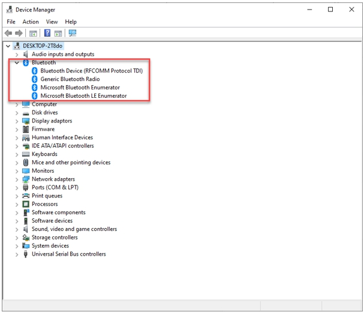

# How to use Hideez Bluetooth Dongle on Windows 10


If you haven’t managed to connect your Bluetooth dongle even though you’ve followed all of the following steps, please [contact us](https://hideez.com/pages/contact-hideez-support) to get support. Our agent will reply back to you with an email within 24 hours.



### If your PC has a built-in Bluetooth adapter, you[ should disable it](troubleshooting.md#how-to-disable-built-in-bluetooth-adapter).

If an alert pops up recommending you restart your PC, restart it.


### Step 1

Insert the Bluetooth dongle into your USB port.

### Step 2

Open the Device Manager, and select **Bluetooth** section.\
[How to open Device Manager](https://support.microsoft.com/en-us/windows/open-device-manager-a7f2db46-faaf-24f0-8b7b-9e4a6032fc8c)


If the dongle does not appear, try inserting it into the USB port again or inserting it into another USB port.


### Step 3

Now you are ready to pair your Bluetooth devices. \
Go to the **Settings -> Bluetooth & other devices** and click the **Add Bluetooth or other device** button**.**

Choose your Bluetooth device from the list and click on the line.

.png>)

The dongle is now connected to your Bluetooth device.
